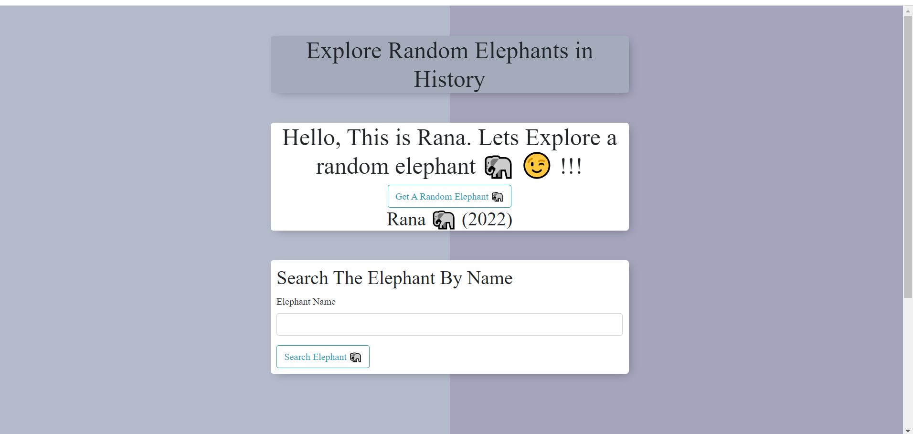
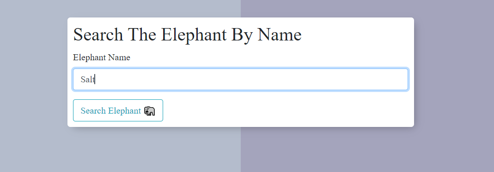

# Elephants in History (2022)
## This is a website that uses data from a public API.

## I used The Elephant API
### https://elephant-api.herokuapp.com/?ref=public-apis

## The UI
### the website allows to get a random elephant in history, to see it and explore it.

### allows you to search for an elephant

## Rana (2022)